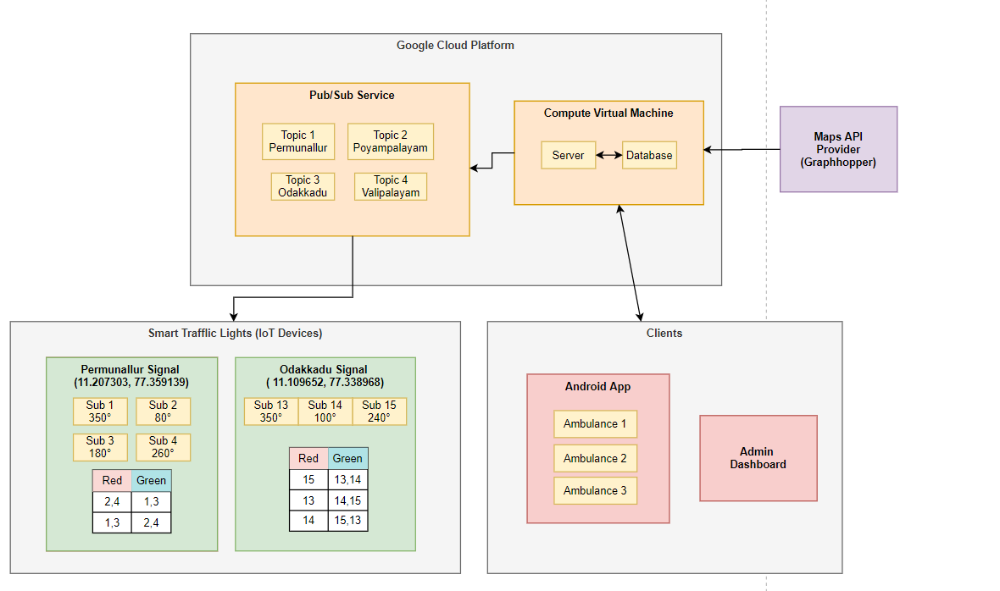
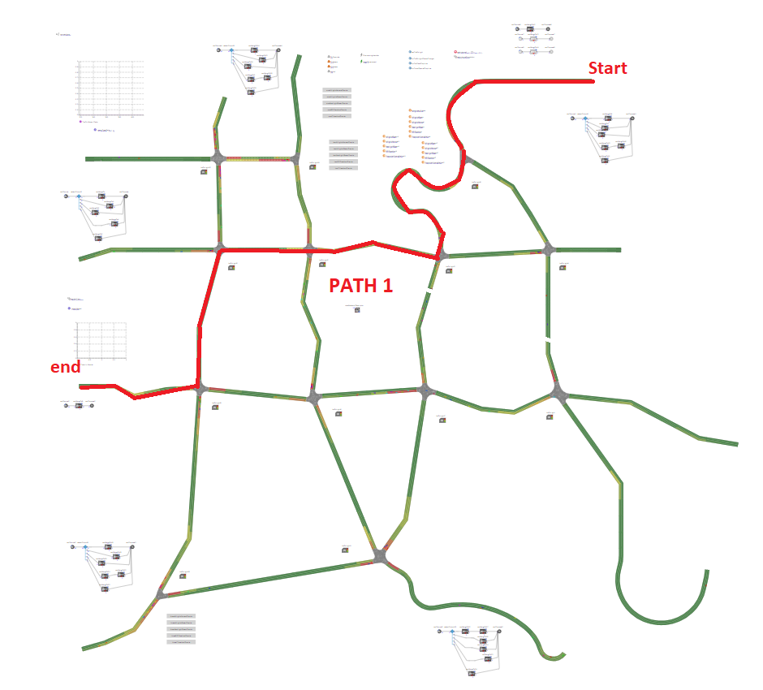
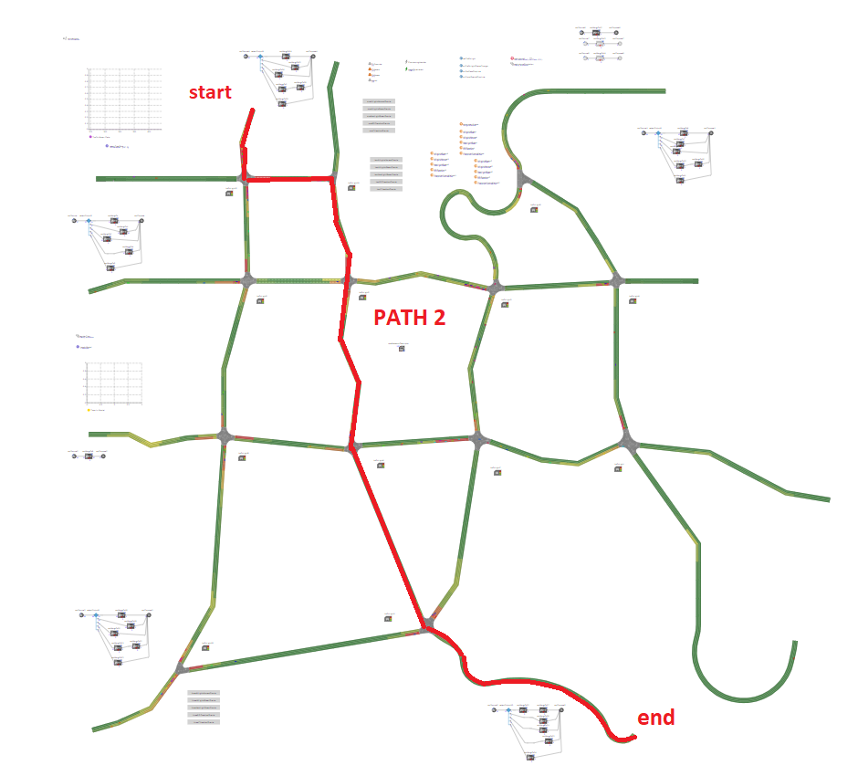
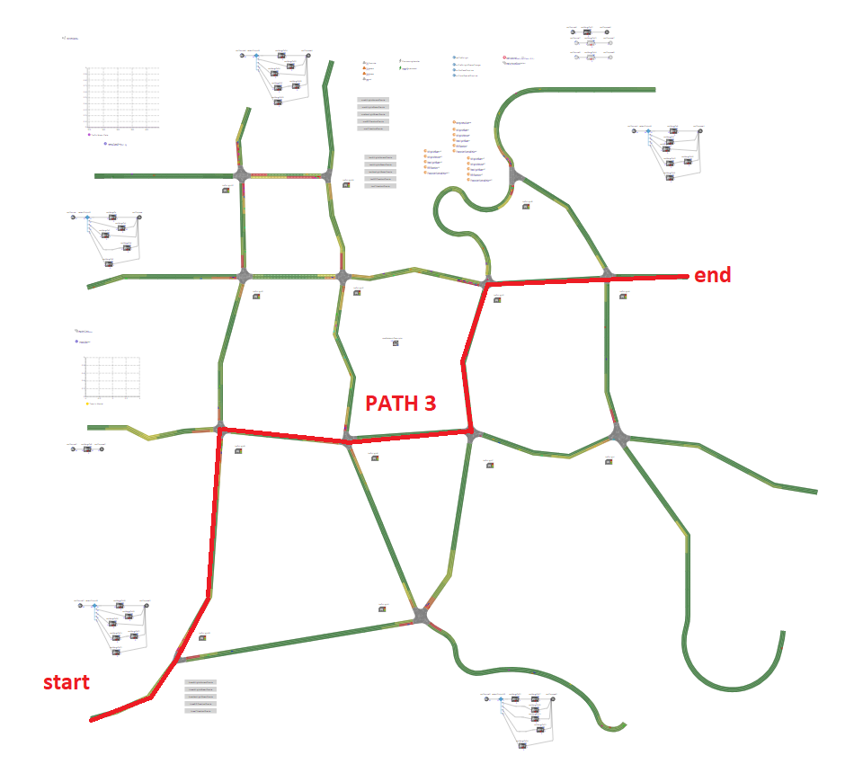
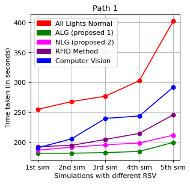
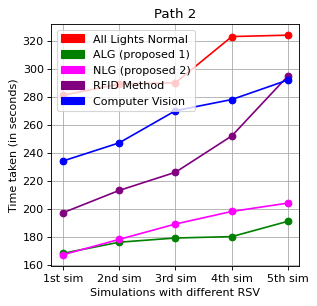
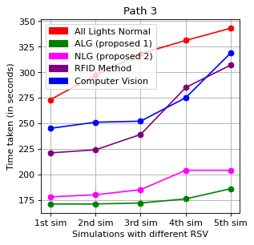
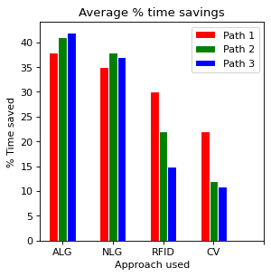

# Smart Traffic Light 

- View the [Project documentation here](https://drive.google.com/file/d/154ADJy3Ga9-2AIqpzzOIytc2UZ3r4cOs/view?usp=sharing)
- View the [Final Presentation PowerPoint here](https://drive.google.com/file/d/1uzcWg4-bDfg9ymzYnNSm4W6SRSHFbR1F/view?usp=sharing). 
- Backend server repo [here](https://github.com/naveennvrgup/smart-traffic-light) 
- Watch our simulation in youtube [ [Path 1 ALG](https://youtu.be/OFKUtP1LqcI) | [Path 3 RFID](https://youtu.be/59R0AbVH7o8) ]  

During emergency situations like motor accidents, fires etc., the emergency vehicles like ambulance, fire brigades etc., getting stuck in the traffic is a nightmare many have to deal with in today’s world. Sadly, many times this leads to the victims losing their lives.Many approaches have been proposed for the problem that includes use of RFID tags and detectors, computer vision, manual override of traffic signals etc.
In this project we propose a new architecture named CSTMC to address the limitations faced by the previous methods by using cloud computing and IoT cluster.

#### Team members:
1. Naveen Sundar 
1. Nilesh Singhania
1. Shristi Agrawal	

#### Screenshots:

